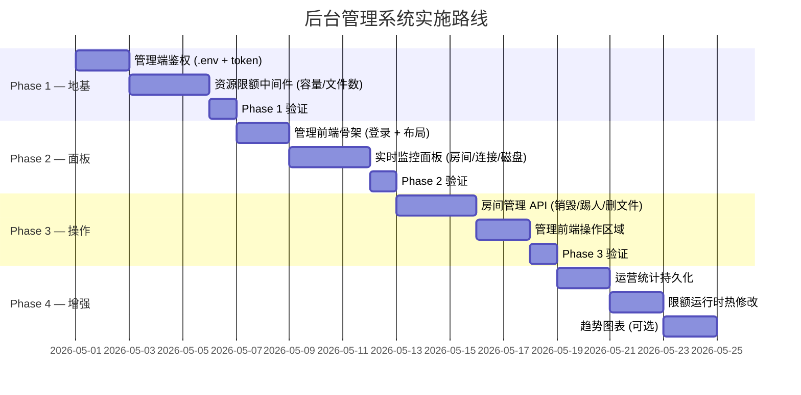

# FT-NET 后台管理系统规划

## 1. 背景与目标

FT-NET 当前以"零配置、密码即房间"的极简模式运行，适合可信局域网场景。但面向公网部署或多用户生产环境时，运营者缺乏以下关键能力：

- 无法监控服务器实时状态（CPU/内存/磁盘/连接数）
- 无法限制资源滥用（无限创建房间、上传超大文件占满磁盘）
- 无法在异常时主动干预（踢人、销毁房间、删除违规文件）
- 无法回溯运营数据（历史房间数、文件吞吐量、峰值在线）

本规划定义一套**独立于用户端的管理面板**，供服务器运营者使用，不改变现有用户端的任何行为。

---

## 2. 架构设计

```
                    ┌─────────────────────────────────┐
                    │         Admin Dashboard          │
                    │     (独立前端 SPA / 独立路由)      │
                    └────────────┬────────────────────┘
                                 │ HTTP API (Bearer Token 鉴权)
                                 ▼
┌────────────────────────────────────────────────────────────┐
│                    server/index.js                         │
│                                                            │
│  ┌──────────────┐  ┌──────────────┐  ┌──────────────────┐  │
│  │ 用户端路由    │  │ 管理端路由    │  │ 资源限额中间件    │  │
│  │ (现有不变)    │  │ /admin/api/* │  │ (容量/文件数检查) │  │
│  └──────────────┘  └──────────────┘  └──────────────────┘  │
│                                                            │
│  ┌──────────────────────────────────────────────────────┐  │
│  │            rooms / uploadSessions / config            │  │
│  │              (内存 + .env + config.json)              │  │
│  └──────────────────────────────────────────────────────┘  │
└────────────────────────────────────────────────────────────┘
```

### 关键设计原则

1. **不侵入现有用户端**：管理功能通过独立路由 `/admin/api/*` 暴露，现有 Socket.IO 和文件接口不受影响
2. **轻量鉴权**：管理端使用 `.env` 中配置的固定 Token（或可选的用户名/密码），不引入数据库或完整用户体系
3. **零数据库依赖**：运营统计数据可持久化到 JSON 文件或 SQLite，保持单文件部署的简洁性
4. **渐进式实施**：每个模块独立可用，可按优先级分批落地

---

## 3. 功能模块详细规划

### 3.1 🖥️ 实时监控面板 (Dashboard)

**目标**：运营者登录后一目了然地掌握服务器全局态势。

| 指标 | 数据来源 | 刷新策略 |
|------|---------|---------|
| 当前活跃房间数 | `rooms.size` | WebSocket 推送 / 5s 轮询 |
| 总在线连接数 | `io.engine.clientsCount` | 同上 |
| 各房间在线人数 | `room.users.size` | 同上 |
| 磁盘已用容量 (uploads/) | `du` 或递归 `fs.statSync` | 30s 轮询 |
| 进程内存占用 | `process.memoryUsage()` | 10s 轮询 |
| 进程 CPU （可选） | `os.cpus()` 差值计算 | 10s 轮询 |
| 进程 uptime | `process.uptime()` | 页面加载时 |
| 活跃上传会话数 | `uploadSessions.size` | 5s 轮询 |

**展示形式**：

- 顶部数字卡片（房间数、在线人数、磁盘用量、内存）
- 房间列表表格（roomId 脱敏显示、人数、文件数、房间存活时长）
- 可选：实时折线图（近 1h 连接数趋势，使用前端 canvas 绘制，无需后端时序库）

---

### 3.2 🚦 资源限额管控

**目标**：防止恶意或无意的资源滥用导致服务器不可用。

#### 3.2.1 限额配置项

| 配置项 | 字段名 | 默认值 | 说明 |
|--------|--------|--------|------|
| 最大并发房间数 | `MAX_ROOMS` | `50` | 达到上限后新建房间返回 503 |
| 单房间最大文件数 | `MAX_FILES_PER_ROOM` | `100` | 超出后拒绝新上传 |
| 单文件最大体积 | `MAX_FILE_SIZE` | `10GB` | 上传 init 阶段拦截 |
| 单房间总容量上限 | `MAX_ROOM_STORAGE` | `20GB` | 该房间已有文件容量 + 新文件 > 上限则拒绝 |
| 全局磁盘容量上限 | `MAX_TOTAL_STORAGE` | `100GB` | 所有房间总占用超标后全局拒绝上传 |
| 单房间最大人数 | `MAX_USERS_PER_ROOM` | `20` | 防止单房间过载 |
| 最大并发上传会话 | `MAX_UPLOAD_SESSIONS` | `10` | 全局并发上传数限制 |

#### 3.2.2 实施位置

- **房间数限制**：`io.on('connection')` → `join_room` 事件处理中，`rooms.size >= MAX_ROOMS` 时拒绝
- **文件数/容量限制**：`POST /upload/init/:roomId` 路由中，在创建 upload session 之前检查
- **单文件大小限制**：同上，校验 `req.body.fileSize`
- **全局磁盘限制**：中间件级别，定期统计 `uploads/` 目录总大小并缓存

#### 3.2.3 配置来源优先级

```
.env 环境变量 > config.json 文件 > 代码内硬编码默认值
```

管理面板支持运行时热修改 `config.json`，无需重启进程。

---

### 3.3 🔧 房间管理操作

**目标**：运营者可对任意房间执行管理操作。

| 操作 | API | 说明 |
|------|-----|------|
| 查看房间列表 | `GET /admin/api/rooms` | 返回所有活跃房间摘要 |
| 查看房间详情 | `GET /admin/api/rooms/:id` | 文件列表、在线用户、加密能力等 |
| 强制销毁房间 | `DELETE /admin/api/rooms/:id` | 踢出所有用户、删除文件、释放内存 |
| 踢出指定用户 | `POST /admin/api/rooms/:id/kick` | 断开该用户 Socket 连接 |
| 删除指定文件 | `DELETE /admin/api/rooms/:id/files/:fileId` | 绕过 senderId 所有者校验 |
| 广播系统消息 | `POST /admin/api/rooms/:id/broadcast` | 以 SYS_MSG 类型推送公告 |

> ⚠️ 房间 ID 为哈希值，管理端**无法**反推原始密码，符合零信任原则。

---

### 3.4 📊 运营统计（可选增强）

**目标**：积累历史数据用于容量规划和运营决策。

| 统计项 | 持久方式 | 说明 |
|--------|---------|------|
| 累计创建房间数 | JSON / SQLite | 自启动以来 |
| 累计中转文件数 & 总字节数 | 同上 | 按日/月聚合 |
| 峰值同时在线人数 | 同上 | 含时间戳 |
| 房间平均存活时长 | 同上 | 用于调优销毁延迟 |

存储方案建议优先使用 JSON 文件 (`server/stats.json`)，若数据量增长再迁移 SQLite。

---

### 3.5 🔐 管理端鉴权

**方案**：`.env` 中声明管理员凭证

```env
# 管理面板鉴权（选择其一）
ADMIN_TOKEN=your-secret-admin-token-here
# 或
ADMIN_USER=admin
ADMIN_PASS=strong-password
```

**认证流程**：

1. 管理面板提供登录页，用户输入凭证
2. 服务端校验后签发一个 session token（存内存，过期时间可配置）
3. 后续所有 `/admin/api/*` 请求需携带 `Authorization: Bearer <token>`
4. 无需引入 JWT 库，简单的随机 token + 内存 Map 即可满足单实例需求

**保护措施**：

- 管理 API 路由独立注册，不与用户路由混用
- 登录失败加入简单的速率限制（5 次失败后锁定 IP 5 分钟）
- 可选：限制管理面板仅监听 `127.0.0.1`（仅允许本机访问）

---

### 3.6 🎨 管理前端技术方案

| 方案 | 优劣 | 推荐度 |
|------|------|--------|
| **A: 独立路由内嵌** — 在现有 Express 中注册 `/admin` 路由，静态托管一个独立的 HTML/JS/CSS 管理 SPA | 零额外依赖，与现有架构一致，单端口部署 | ⭐⭐⭐ 推荐 |
| B: 独立端口 — 在另一个端口启动独立的管理服务 | 隔离性更好，但增加部署复杂度 | ⭐⭐ |
| C: 纯 CLI 终端面板 — 无 Web UI，命令行交互 | 最轻量，但操作体验差 | ⭐ |

**推荐方案 A**：在 `server/admin/` 目录下放置管理面板静态文件，Express 注册 `/admin` 路由托管。管理面板可用纯原生 HTML + Vanilla JS 编写（与主项目不耦合 React 构建链），保持轻量。

---

## 4. 实施路线图



### 优先级排序

| 优先级 | 模块 | 理由 |
|--------|------|------|
| **P0** | 资源限额 (3.2) | 防护性功能，公网部署的硬性前提 |
| **P0** | 管理端鉴权 (3.5) | 所有管理功能的前置条件 |
| **P1** | 实时监控面板 (3.1) | 运营可见性，日常必用 |
| **P1** | 房间管理操作 (3.3) | 应急处置能力 |
| **P2** | 运营统计 (3.4) | 锦上添花，非紧急 |

---

## 5. 对现有代码的改动预估

| 文件 | 改动类型 | 说明 |
|------|---------|------|
| `server/index.js` | 修改 | 新增限额检查逻辑、管理 API 路由注册、鉴权中间件 |
| `.env` | 修改 | 新增 `ADMIN_TOKEN` / 限额配置项 |
| `server/admin/` | **新建目录** | 管理面板前端静态文件 |
| `server/config.js` | **新建** | 统一配置加载逻辑（.env → config.json → defaults） |
| `server/middleware/` | **新建目录** | 鉴权中间件、限额中间件 |

> ⚠️ **不改动前端** (`src/` 目录)：管理面板完全独立于用户端 React 应用。

---

## 6. 安全考量

- 管理 API 必须独立鉴权，不复用房间密码体系
- 管理面板不应暴露房间原始密码（仅显示哈希后的 roomId）
- 管理面板不应能解密 E2EE 密文（服务端不持有密钥，符合零信任架构）
- 强制销毁房间时应先广播通知再断开连接，给用户端缓冲时间
- 生产部署建议通过 Nginx 对 `/admin` 路径做 IP 白名单限制
