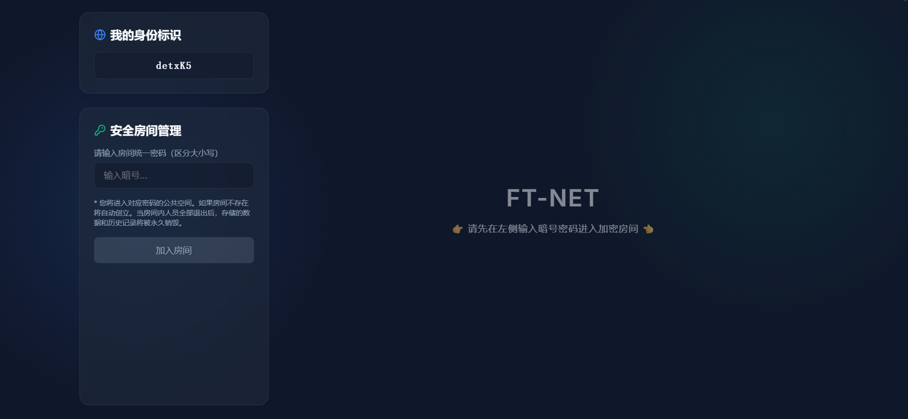

<p align="center">
  <h1 align="center">🌐 FT-NET</h1>
  <p align="center">
    <b>零配置 · 密码即房间 · 阅后即焚</b><br/>
    基于星型拓扑的局域网/公网即时群组通讯与文件共享一体化平台
  </p>
</p>

<p align="center">
  
  
  
  
  
</p>

<p align="center">
  
</p>

---

## ✨ 产品亮点

| 特性 | 描述 |
|------|------|
| 🔑 **密码即房间** | 无需注册账号，输入相同密码的用户自动进入同一个私密群组空间 |
| 💾 **服务端物理存储** | 上传的文件实体安全保存在服务器磁盘，房间内所有人可随时主动拉取下载 |
| 💬 **实时群组通讯** | 基于 Socket.IO 的多人即时聊天，中途加入的成员自动同步全部历史记录 |
| 📦 **批量文件管理** | 支持全选/多选复选框，一键批量下载或删除服务器上的文件资源 |
| ♻️ **阅后即焚** | 当房间人数归零时，服务器自动销毁该房间的全部聊天记录与物理文件 |
| 🛡️ **大文件稳传** | 移除 Node.js 默认超时限制 + 前端自动重试机制，支持 GB 级文件稳定传输 |
| 🚚 **分块上传降压** | 上传端按分片加密/上传，服务端顺序落盘，避免大文件“整份加密后再整份上传”带来的高内存占用 |
| 🔐 **可选上传模式** | 支持“端到端加密上传 / 明文直传”两种模式，兼顾隐私保护与性能较弱设备的可用性 |
| 🧩 **E2EE v2 双栈兼容** | 新消息与新加密文件已接入 `Web Crypto API + PBKDF2 + HKDF + AES-GCM`，同时保留 `v1 / v2` 双读兼容 |
| 🧾 **文件名元数据加密** | 加密文件的 `fileName` 会以 `encryptedMetadata` 形式存储，服务端不再直接暴露原始文件名 |
| 💽 **下载能力分流** | 支持流式保存的浏览器可边下载边写入本地文件；不支持时自动回退并提示内存占用风险 |
| 🎨 **现代暗黑 UI** | Glassmorphism 毛玻璃设计 + 聊天气泡 + 响应式自适应滑窗布局 |
| 👁️ **文件快捷预览** | 图片/PDF/文本代码文件（txt/md/json/csv/js/py 等 30+ 格式）无需下载即可在线预览 |

---

## 🏗️ 系统架构

```
┌──────────────────────────────────────────────────┐
│              Browser (React + Vite)              │
│  ┌────────────┐  ┌──────────┐  ┌──────────────┐  │
│  │ 密码大厅    │  │ 群组通讯  │  │ 公共存储柜   │  │
│  └─────┬──────┘  └────┬─────┘  └──────┬───────┘  │
│        │              │               │           │
│        └──────────────┼───────────────┘           │
│                       │ 同源单端口                 │
└───────────────────────┼──────────────────────────┘
                        ▼
┌───────────────────────────────────────────────────┐
│          Node.js Express + Socket.IO              │
│          (统一端口: PORT from .env)                │
│                                                   │
│  ┌─────────┐  ┌──────────┐  ┌──────────────────┐ │
│  │ 房间管理 │  │ 消息广播  │  │ 文件存储/下载    │ │
│  │ (内存)   │  │ (Socket) │  │ (磁盘 /uploads/) │ │
│  └─────────┘  └──────────┘  └──────────────────┘ │
│                                                   │
│  🗑️ 人数归零 → 自动销毁内存 + rm -rf 物理文件     │
└───────────────────────────────────────────────────┘
```

**核心设计：端云合一同源架构** — 前端静态资源由 Express 直接托管分发，WebSocket 通讯与 HTTP 文件接口共享同一端口。一个端口解决所有问题，彻底免疫防火墙跨域拦截。

---

## 🚀 快速开始

### 环境要求
- **Node.js** ≥ v18（推荐 v20）
- **npm** ≥ v8

### 安装与运行

```bash
# 1. 克隆项目
git clone <your-repo-url>
cd FT-NET

# 2. 安装依赖
npm install

# 3. 编译前端
npm run build

# 4. 启动服务（一个命令，全站就绪）
node server/index.js
```

启动后访问终端显示的地址（默认 `http://localhost:31208`），在任意设备浏览器输入相同密码即可组建群组。

### 💡 技术规范核心对比

#### 1. 加密架构对比 (E2EE)
| 维度 | E2EE Secured v2 (旗舰) | E2EE Secured v1 (兼容) |
| :--- | :--- | :--- |
| **算法模式** | `AES-GCM` (独立分块验证) | `AES-CBC` (链式流加密) |
| **断点续传** | ✅ **支持** (文件指纹秒传 + 进度无缝恢复) | ❌ **不支持** (上下文强关联，无法随机读写) |
| **完整性校验**| 内置 AAD 抗篡改校验 | 仅基础加密，无内置完整性校验 |
| **适用环境** | HTTPS / Localhost (浏览器受信域) | 局域网 HTTP (非受信受限环境自动降级) |

#### 2. 下载落盘模式对比
| 维度 | 流式保存 (Stream) | 内存回退 (Memory Fallback) |
| :--- | :--- | :--- |
| **内存 (RAM) 开销** | ✅ **极低** (底层管道串流直通硬盘) | ❌ **极大** (数据全量暴毙式堆积在页面内存池) |
| **大文件稳定性** | 极高，支持 100GB+ 级超大文件下载 | ⚠️ **高风险**！大文件必爆内存导致浏览器崩溃 |
| **API 要求** | 需要 `File System Access API` | 无，走传统 Blob 生成链路 |
| **最佳实践** | 现代 Chrome / Edge + HTTPS 证书 | 仅建议用于下载临时小文件 |

> ⚠️ **严重警告**：在“内存回退”模式下下载加密大文件（如超清电影等）会强制抽走与文件等量的电脑硬件运行内存（RAM），极大概率导致网页卡死或操作系统响应缓慢！强烈建议通过 HTTPS 部署以解锁完整流式性能。

### 环境变量配置

编辑项目根目录下的 `.env` 文件自定义端口：

```env
# 统一服务端口（同时承载网页面板 + WebSocket + 文件接口）
PORT=31208
```

---

## 📁 项目结构

```
FT-NET/
├── .env                    # 环境变量配置
├── server/
│   └── index.js            # Node.js 服务端（房间管理 + 分块上传 + 文件存储 + 静态托管）
├── src/
│   ├── hooks/
│   │   └── usePeer.ts      # 核心通讯 Hook（Socket.IO + v1/v2 双栈加密 + 分块上传 + 元数据解密）
│   ├── components/
│   │   ├── ConnectionPanel.tsx   # 密码大厅入口
│   │   ├── ChatBox.tsx           # 群组通讯录
│   │   └── FileTransfer.tsx      # 公共存储柜（上传模式切换 / 元数据锁定态提示 / 预览 / 下载分流）
│   ├── utils/
│   │   ├── cryptoUtils.ts        # 历史 v1 文本与文件加解密工具
│   │   ├── e2eeV2.ts            # E2EE v2 公共派生与编码工具
│   │   ├── messageCryptoV2.ts   # 文本消息 v2 加解密
│   │   ├── fileCryptoV2.ts      # 文件内容 v2 分片加解密工具
│   │   └── metadataCryptoV2.ts  # 文件元数据 v2 加解密工具
│   ├── workers/
│   │   ├── encryptWorker.ts     # 历史 v1 分块加密 Worker
│   │   ├── decryptWorker.ts     # 历史 v1 分块解密 Worker
│   │   ├── encryptWorkerV2.ts   # 文件内容 v2 分块加密 Worker
│   │   └── decryptWorkerV2.ts   # 文件内容 v2 分块解密 Worker
│   ├── types.ts            # TypeScript 类型定义
│   ├── App.tsx             # 主应用组件
│   ├── index.css           # 全局样式系统
│   └── main.tsx            # 入口文件
├── Doc/
│   ├── User_Manual.md      # 使用手册
│   ├── Deployment_Guide.md # 服务器部署指南
│   ├── Encryption_Plan.md  # 端到端加密规划
│   └── E2EE_V2_Technical_Design.md # E2EE v2 技术草案
└── dist/                   # 编译产物（由 npm run build 生成）
```

---

## 🌍 服务器部署

> 详细教程请见 [`Doc/Deployment_Guide.md`](Doc/Deployment_Guide.md)

精简版：

```bash
# 上传项目至服务器后
cd /your/path/FT-NET
npm install
npm install -g pm2
pm2 start server/index.js --name ftnet
pm2 save && pm2 startup
```

记得在云服务器安全组中**放行 `.env` 中配置的端口**（默认 `31208`）。

如需绑定域名，配置 Nginx 反向代理时务必加上 WebSocket 升级头：

```nginx
location / {
    proxy_pass http://127.0.0.1:31208;
    proxy_http_version 1.1;
    proxy_set_header Upgrade $http_upgrade;
    proxy_set_header Connection "Upgrade";
}
```

---

## 📋 更新日志


### v1.9.0 — E2EE 统一密钥策略收口
- 🕵️ **发送者身份保护**：V2 消息中 `senderName` 现已跟随消息正文一同 AES-GCM 加密传输，服务端不再能直接看到消息发送者身份
- 🖥️ **安全状态摘要面板**：连接面板在加入房间后新增完整的安全态势快览，涵盖消息加密版本、文件加密版本、文件名保护、下载落盘模式、密钥体系、断点续传等 6 项
- 🛡️ **GCM 完整性校验增强**：当 AES-GCM 认证标签校验失败（密文损坏或被篡改）时，消息气泡与文件预览将显示专项警告而非通用错误

### v1.8.0 — 身份固化与抗断网续传 (Resumable Uploads)
- 🆔 **身份标识持久化**：`peerId` 现已托管至 `localStorage`。页面刷新不再丢失身份，完美保留文件所有者权限与会话状态
- 🔄 **用户自主身份刷新**：连接面板新增“刷新”图标，支持用户手动重置身份标识并即时生效
- 📈 **抗断网断点续传 (V2)**：基于 `SHA-256` 文件元数据指纹校验，上传异常中断后（如刷新页面、断网）再次上传同一文件可秒速定位断点并顺接传输
- ⏳ **房间销毁 45s 宽限期**：服务端新增退出后延时销毁机制，彻底解决单人刷新页面导致房间数据被即刻抹除的痛点
- 🎨 **技术架构透明化**：重构了 `v1/v2` 加密标识与 `流式保存/内存回退` 的 UI 交互，新增带深度警告的技术规范对比说明浮窗

### v1.7.0 — 安全加固与 E2EE 体验优化
- 🛡️ **服务端越权拦截**：重构了文件删除接口，增加了针对连接身份 (`senderId`) 的强制查验，杜绝仅凭 `roomId` 随意删除文件的越权风险
- 🔑 **无缝零延迟加密**：进入房间后将在后台静默触发 PBKDF2/HKDF （约二十万次 hash）运算预热，彻底消除首次发送消息与上传文件时的卡顿
- 💾 **上传偏好记忆**：新增对“加密上传”与“明文直传”模式偏好的 `localStorage` 记忆，优化多重并发传文件的体验
- ⚠️ **弱密码拦截提示**：在大厅输入弱密码（< 6 位）时动态提示加密强度降级风险，引导生成更高质量的加密初始种子
- 🐛 **并发稳固与代码清理**：剔除了服务端高频数组越界隐患（替换 `splice` 循环），彻底隔离了同密码异标签在 `e2eeV2` 中的缓存穿透漏洞

### v1.6.0 — E2EE v2 元数据加密与协议收口
- 🧩 **E2EE v2 双栈落地**：新消息与新加密文件已统一接入 `Web Crypto API + PBKDF2 + HKDF + AES-GCM`，并保留 `v1 / v2` 双读兼容能力
- 🧾 **文件元数据加密**：加密上传时会将 `fileName` 封装为 `encryptedMetadata` 存储，服务端物理文件名改为随机 `id`，进一步降低明文暴露面
- 🗂️ **文件列表自动解密展示**：客户端在接收房间历史、`file-added`、`files-updated` 时会自动解密文件名；若环境不支持或无法解密，则显示“文件名未解锁”状态并保留文件内容下载能力
- 📘 **技术文档补全**：新增 [`Doc/E2EE_V2_Technical_Design.md`](Doc/E2EE_V2_Technical_Design.md)，明确消息 v2、文件内容 v2、元数据加密与恢复能力增强的推进顺序

### v1.5.0 — 分块上传、可选加密与低内存下载
- 🚚 **分块上传与顺序落盘**：上传端改为分片处理，服务端通过 `init / chunk / complete / abort` 协议顺序写盘，显著降低大文件上传时的浏览器内存压力
- 🔐 **可选上传模式**：文件上传支持“端到端加密上传 / 明文直传”切换，文件列表新增“已加密 / 未加密”状态标记与筛选
- 💽 **下载能力分流**：支持流式保存的浏览器可边下载边解密边写入本地文件；不支持时自动回退到内存模式，并在界面中提示原因
- 🧭 **交互增强**：新增上传模式说明、浏览器能力提示、进入房间后的滚动位置修正，以及群组通讯录仅在自身区域内自动滚动

### v1.4.0 — 文件在线预览
- 👁️ **图片/PDF 在线预览**：文件列表中对图片（jpg/png/gif/webp/bmp/svg）和 PDF 文件显示预览按钮，点击即弹出全屏毛玻璃遮罩预览窗口
- 📝 **文本/代码文件预览**：支持 txt、md、json、csv、log、yaml、xml、js、ts、py、java、go 等 30+ 种常见文本格式，暗黑主题等宽字体渲染
- 🔧 **服务端内联返回**：新增 `?preview=1` 查询参数支持，预览时使用 `Content-Disposition: inline` 内联返回文件流，全部文本类 MIME 强制 `charset=utf-8` 确保中文正常显示

### v1.3.0 — 多文件批量上传与在线人数显示
- 📂 **拖拽多文件批量上传**：拖拽区和文件选择器均支持一次选中多个文件同时上传
- 👥 **房间在线人数实时显示**：左侧面板实时展示当前房间在线人数徽标，随进出即时刷新

### v1.2.0 — 大文件传输稳定性加固
- 🔧 **移除 Node.js HTTP Server 默认超时限制**（`timeout`、`headersTimeout`、`requestTimeout`、`keepAliveTimeout` 全部置零），彻底根治大文件上传中途被静默截断的问题
- 🔧 **前端 XHR 超时解锁**：将浏览器端 `xhr.timeout` 设为 `0`，并增加 `ontimeout` / `onabort` 精确事件捕获
- 🔄 **智能重试机制**：上传失败后自动等待 1.5 秒重试，最多 3 次，提升弱网环境稳定性
- 📏 **Multer 体积上限**：显式声明单文件最大 10GB 上传限制

### v1.1.0 — 批量管理与环境变量
- ✅ 文件列表复选框：支持全选/多选/单选
- 🗑️ 批量下载与批量删除功能
- ⚙️ 引入 `.env` 环境变量配置，端口可热插拔
- 📖 新增 `Doc/` 目录：部署指南、使用手册、加密规划

### v1.0.0 — 星型拓扑中心化房间架构
- 🏠 密码即房间：输入相同密码自动进入同一群组
- 💾 服务端文件物理存储与按需拉取下载
- 💬 Socket.IO 实时群聊 + 历史消息漫游同步
- ♻️ 人数归零自动销毁房间数据与物理文件
- 🎨 暗黑毛玻璃 UI + 聊天气泡 + 响应式滑窗布局
- 🌐 端云合一同源架构：单端口同时承载前端 + API + WebSocket

---

## 🔮 To-do

- [x] ~~完善端到端加密 (E2EE)：已实现消息/文件/元数据/发送者名的统一 v2 密钥策略，含 PBKDF2+HKDF 子密钥分工、GCM 完整性校验与安全状态面板~~
- [ ] HTTPS / WSS 传输层加密
- [ ] **后台管理系统**：运营者专属的监控与管控面板（详见 [`Doc/Admin_Dashboard_Plan.md`](Doc/Admin_Dashboard_Plan.md)）
  - 实时监控面板（房间数/在线人数/磁盘与内存用量/上传会话）
  - 资源限额管控（最大房间数、单文件大小、单房间容量、全局磁盘上限、房间人数上限）
  - 房间管理操作（强制销毁房间、踢出用户、删除文件、广播系统公告）
  - 运营统计（累计房间数/文件吞吐量/峰值在线/房间存活时长）
  - 管理端独立鉴权（Token / 用户名密码，IP 速率限制）
- [x] ~~抗断网断点上传 (基于 V2 架构的文件指纹断点续传)~~
- [x] ~~身份标识持久化与手动刷新功能~~
- [x] ~~房间销毁 45s 延时宽限期 (防止刷新导致数据丢失)~~
- [x] ~~上传模式偏好记忆（记住上次选择“加密上传”或“明文直传”）~~
- [x] ~~文件名元数据加密（`encryptedMetadata`）~~
- [x] ~~房间在线人数实时显示~~
- [x] ~~文件预览（图片/PDF/文本等 30+ 格式）~~
- [x] ~~拖拽多文件批量上传~~

---

## 📄 License

MIT
